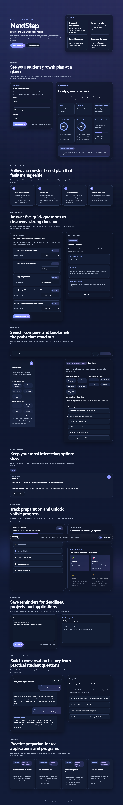
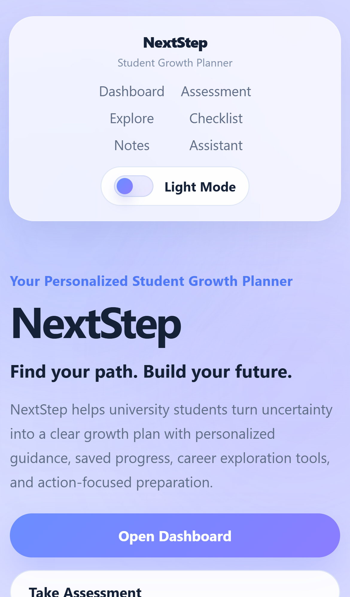

# NextStep

**Tagline:** Your Personalized Student Growth Planner

NextStep is a responsive student growth planning web application built with HTML, CSS, Vanilla JavaScript, and `localStorage`. It was designed to help university students turn uncertainty about career direction into clearer action through guided exploration, practical preparation, and visible progress tracking.

## Why I Built This

This project was inspired by my experience as an Information Systems student who often felt uncertain about career direction, portfolio preparation, competitions, and internship readiness.

NextStep was designed to help students transform uncertainty into actionable growth plans through structured guidance and practical preparation.

## Features

- Unified NextStep branding with a consistent tagline and portfolio-ready presentation
- Student dashboard with saved name, major, semester, recommended focus, and progress indicators
- Personalized action plan that adjusts to semester stage
- Career assessment with saved recommendation results
- Career explorer with search, dynamic content, bookmarks, and roadmap selection
- My Favorite Careers section powered by `localStorage`
- Portfolio checklist with progress tracking and achievement badges
- Personal notes section with editable saved notes
- Guided Career Assistant Simulation with predefined responses and conversation history
- Opportunities section with sample preparation targets
- Dark mode with saved preference and responsive glassmorphism-inspired design
- About and project story sections for a stronger portfolio presentation

## Technologies

- HTML5
- CSS3
- Vanilla JavaScript
- Browser `localStorage`

## How to Run

1. Open the project folder.
2. Keep these files in the same directory:
   - `index.html`
   - `style.css`
   - `script.js`
   - `README.md`
3. Open `index.html` in a modern browser.

No frameworks, build tools, or installation steps are required.

## Folder Structure

```text
nextstep/
|-- index.html
|-- style.css
|-- script.js
|-- README.md
`-- outputs/
```

## Screenshots

### Desktop Showcase



### Mobile Showcase



## Project Sections

### Dashboard

The dashboard stores student profile data and shows:

- Greeting message
- Major
- Semester
- Recommended focus
- Progress indicators

### Career Discovery

Students can:

- Take a career assessment
- Explore five career paths
- Search career cards
- Save favorite careers
- Jump directly to a recommended roadmap

### Progress Planning

Students can:

- Follow a semester-based action plan
- Track portfolio preparation progress
- Unlock readiness badges
- Save personal reminders in notes

### Guided Assistant

The Guided Career Assistant Simulation uses predefined responses and keeps a conversation history for learning and guidance purposes.

## Future Improvements

- Add resource links for each career roadmap
- Add export options for notes, action plans, or checklist progress
- Add more career paths and opportunity categories
- Add reminder scheduling for deadlines and application targets
- Add optional charts for longer-term growth tracking

## Beginner-Friendly Notes

- `index.html` contains the structure and content sections
- `style.css` controls layout, theme variables, responsive styling, and visual polish
- `script.js` handles rendering, events, and `localStorage`
- Reusable functions are used to keep the code easier to follow and update
